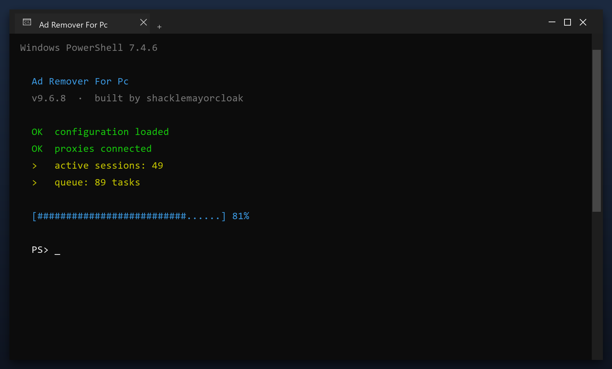

# Ad Remover For Pc — Latest Version Free Download (2026)

  

  

**Ad remover for pc** is a Windows utility that keeps your PC clean and running fast. It is the current 2026 build, tested on Windows 10 and 11. **Free. No registration. No bundled adware.**

## Overview

Think of ad remover for pc as a housekeeper for your computer. Over time, files pile up that nobody uses - installers you ran once, caches, old logs. The tool finds those piles and clears them, which frees space and often speeds the PC up.

| **Term** | **Meaning** |
| --- | --- |
| **Cache** | Saved data that can be rebuilt |
| **Leftover** | A file an uninstall forgot |
| **Duplicate** | The same file stored twice |
| **Free space** | Room available on your drive |

## The Problem

- **Low free space** - junk files quietly eat your disk
- **Unstable system** - leftover entries cause freezes and errors
- **Manual work** - cleaning by hand takes hours
- **Unsafe downloads** - fake tools are everywhere
- **Confusing options** - most tools are hard to understand

## How It Fixes It

| **Problem** | **Solution** |
| --- | --- |
| **Slow startup** | Disable unneeded startup items |
| **Cluttered disk** | Remove junk and temp files |
| **Registry errors** | Scan and repair broken entries |
| **Hidden settings** | One clear control panel |
| **Bundled junk** | Clean installer, no adware |

## Install

1. **Grab the file** using the green button
2. **Extract** it to a folder of your choice
3. **Run** the tool (as admin for full access)
4. **Read** the scan report
5. **Apply** the fixes and reboot

  

> **Note:** if nothing happens when you click, run the file as administrator. Windows sometimes blocks new programs until you allow them.

## Features

| **Feature** | **Details** |
| --- | --- |
| **Interface** | Single window, no clutter |
| **Learning curve** | None - obvious buttons |
| **Languages** | English |
| **Permissions** | Admin for some tasks |
| **Conflicts** | None with other tools |
| **Uninstall** | Clean, leaves nothing behind |

## Requirements

| **Component** | **Requirement** |
| --- | --- |
| **Operating system** | Windows 10 or 11 (64-bit) |
| **RAM** | 2 GB or more |
| **Free disk space** | 100 MB |
| **Permissions** | Administrator (for some tasks) |

## What's Included

| **Component** | **Details** |
| --- | --- |
| **Installer** | Single file, no extras |
| **Readme** | Short setup notes |
| **Restore point** | Made automatically |
| **Uninstaller** | Standard Windows removal |

## Compared With Alternatives

| **Feature** | **Other free tools** | **ad remover for pc** |
| --- | --- | --- |
| **Bundled adware** | Often | Never |
| **Accounts** | Sometimes | Not needed |
| **Telemetry** | Often on | Off |
| **Cost** | Free with upsells | Free |

## Tips

- Start with a quick scan before a deep scan
- Deep scans take longer but find more
- Check free space before and after
- Note any errors and check the FAQ
- Repeat monthly for consistent speed

## Troubleshooting

| **Issue** | **Fix** |
| --- | --- |
| **Windows warns about the file** | Click More info, then Run anyway |
| **Slow first launch** | Normal - it indexes on first run |
| **Scan finds nothing** | Good - your PC is already clean |
| **Settings do not save** | Run as admin once so it can write config |

## FAQ

**Is admin access required?**

For a full cleanup, yes. Without it the tool only cleans your user folders.

**Will it fix my registry?**

It can scan and repair broken entries, and it backs up before changing anything.

**Does it work offline?**

Yes - once downloaded it needs no internet connection.

**How much space will I save?**

It varies, but most PCs recover several gigabytes on the first run.

## Summary

In short: **ad remover for pc** finds the clutter that slows your PC down and removes it safely. No accounts, no telemetry, no ads - just a small tool that works.

- Scans in minutes
- Creates a restore point first
- Works offline
- Free for personal use

**Download it above and run your first scan.**

---

*wise-summit-197 · Updated 2026-10-09 · Shared under the MIT License*
